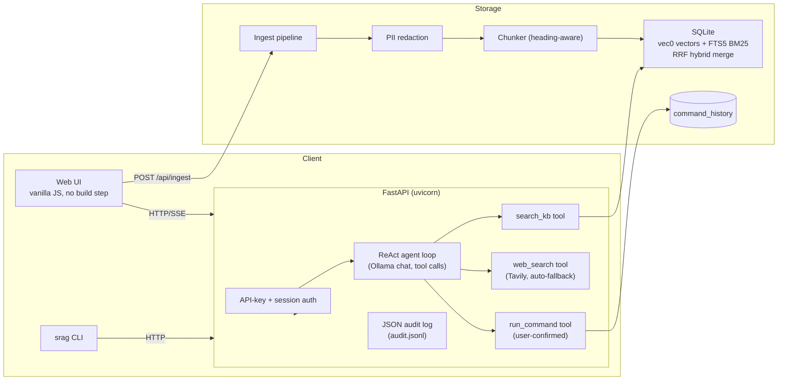

# secure-rag (srag) — RAG Document Q&A for Civil Society Organizations

RAG document Q&A service for civil society organizations — offline-capable,
denied-by-default, fully containerized.

Load policy documents, reports, and legislation. Ask questions in plain
language. Get grounded answers with citations — all computed on the machine
you're using, never sent to a third party. For NGOs and CSOs handling
sensitive beneficiary data, that boundary isn't a feature, it's the point.

## Quick Start

```bash
# 1. Install
cd ~/secure-rag
pip install -e .

# 2. Make sure Ollama has the models listed in PROGRAM.md
ollama list

# 3. Ingest the bundled sample corpus (UN/FAO policy PDFs)
srag add samples/

# 4. Ingest a live policy URL (must match the URL whitelist)
srag add --url https://www.un.org/en/

# 5. Ask a question
srag query "what is the minimum age for hazardous work under the convention?"

# 6. Open web UI
srag serve
# → http://localhost:8000
```

## Run with Docker

Prereq: Docker Desktop (or Docker Engine + compose plugin).

```bash
# API container + your host's Ollama (keeps GPU + your existing models)
docker compose --profile host-ollama up

# Self-contained demo: bundled Ollama + llama3.2:3b + nomic-embed-text
# + the sample PDF corpus, all pulled on first boot (~2.3GB first pull)
docker compose --profile bundled --profile demo-data up
```

Then open http://localhost:8000. The `host-ollama` and `bundled` profiles are
mutually exclusive (both bind host port 8000) — run only one at a time.

Config precedence: env vars (`SRAG_MODEL`, `SRAG_EMBED_MODEL`,
`SRAG_PROGRAM_PATH`, `OLLAMA_HOST`) > `config.toml` (created with defaults on
first boot). The bundled profile sets the small models via env vars; for the
host-Ollama profile, set `SRAG_MODEL`/`SRAG_EMBED_MODEL` or edit the config
volume. `PROGRAM.md` is mounted read-only into the container for governance.

Data persists in the `srag-data` volume. Full reset:

```bash
docker compose down -v
```

Note: on Linux, `host.docker.internal` is wired via `extra_hosts` in the
compose file; on macOS/Windows it works out of the box.

## Central Control — PROGRAM.md

**Every operation requires approval through PROGRAM.md.** This file is the
single source of truth for what secure-rag can do. Edit it, save it, and the
agent enforces it on the next query.

```yaml
# PROGRAM.md — what you control:

## Models                  # which Ollama models to use
chat: llama3.2:3b
embed: nomic-embed-text

## Path Whitelist          # only these directories can be ingested
ingest_paths:
  - /samples/
  - /Users/bila/secure-rag/

## URL Whitelist           # only these URL prefixes can be scraped
ingest_urls:
  - https://www.un.org/
  - https://moeys.gov.kh/

## Command Execution       # OFF by default — you must explicitly enable
commands_enabled: false    # set to true when you're ready

## Query Behavior
top_k: 5                   # max chunks returned per search
max_iterations: 5          # max ReAct loop iterations
trusted: false             # if true, commands run without prompt
```

### Safety model

| Setting | Default | What it does |
|---------|---------|-------------|
| `commands_enabled` | `false` | Blocks ALL shell commands until you explicitly approve |
| Path whitelist | `samples/` + repo dir | Only listed directories can be ingested |
| URL whitelist | `un.org`, `moeys.gov.kh` | Only listed URL prefixes can be scraped |
| Blocked patterns | permanent | `rm -rf`, `dd if=`, `mkfs`, `shutdown`, `reboot`, fork bombs — never allowed |
| Confirmation prompt | per-command | Even when enabled, YOU must type `y` for each command |
| Host binding | `127.0.0.1` | Listens on loopback only — not reachable on the LAN by default |

**To enable commands:** open `PROGRAM.md`, change `commands_enabled: false` to
`commands_enabled: true`, save. That's your explicit approval.

## Commands

```
srag add <path>              # Ingest a file or directory
srag add --url <url>         # Ingest a web page
srag add --watch <dir>       # Watch a directory for changes

srag query "question"        # Ask a question (streaming answer)
srag query -k 10 "q"         # Return more search results

srag list                    # Show all ingested documents
srag delete <doc-id>         # Remove a document

srag serve                   # Start web UI at http://localhost:8000
srag serve --port 3000       # Custom port

srag models                  # List available Ollama models
srag config show             # Show current config
srag config set model llama3.1:8b  # Switch chat model
srag config set embed_model nomic-embed-text  # Switch embedding model

srag reindex                 # Re-embed all docs (after switching embed model)
```

## Web UI

```
http://localhost:8000/          Chat — ask questions, see streaming answers
http://localhost:8000/docs-ui   Documents — add, list, delete knowledge
http://localhost:8000/history   History — command execution log
http://localhost:8000/notes     Notes — post-incident notes linked to queries
```

## Architecture



## Design decisions & trade-offs

**Why not LangChain's RecursiveCharacterTextSplitter?** The chunker tracks
markdown heading breadcrumbs (so a chunk about a treaty section carries its
full article context) and skips heading detection inside fenced code blocks —
both behaviors the off-the-shelf splitter doesn't give you. Chunk size is 512
tokens with 64 overlap: big enough to hold a coherent clause or procedure,
small enough to keep retrieval precise and embedding cheap. LangChain's
RecursiveCharacterTextSplitter is a fine default but no heading context; the
custom path is ~100 lines with no framework lock-in. The agent loop is
hand-rolled for the same reason.

**Why not sentence-transformers?** Embeddings run through Ollama
(`nomic-embed-text`) instead of a `sentence-transformers`/`torch` stack. That
keeps the Python dependency tree small and the Docker image ~300MB instead of
multiple GB, and it means one runtime (Ollama) serves both the chat model and
the embeddings — fewer moving parts in a field-office deployment.

**Why not Chroma?** The store is SQLite `vec0` for vectors plus FTS5 for BM25,
merged with Reciprocal Rank Fusion (RRF). SQLite puts the entire knowledge
base — vector index, full-text index, and relational tables — in one portable
file with zero extra services to install, run, or back up. Chroma works for
demos but adds a separate process; the real win here is hybrid retrieval.
Policy documents are full of exact terms that matter — article numbers,
clause references, agency names, dates. Pure vector search blurs them; pure
lexical (FTS5/BM25) misses paraphrases. Running both and merging by rank
position (RRF) sidesteps the fact that vector distance and BM25 scores live
on incompatible scales. The cost is two searches per query, which is cheap at
this scale.

**Why local models (llama3.2:3b / nomic-embed-text)?** Documents never leave
the machine. No API key, no per-token cost, no data crossing a network — which
is decisive for NGOs holding beneficiary records, medical data, and legal
material. Offline capability means an office with patchy connectivity can
still run its document Q&A.

**Why this chunk size?** 512 tokens is large enough to contain a complete
policy clause with context; 64 tokens of overlap keeps cross-chunk sentence
boundaries from splitting answers in half. Smaller chunks would multiply
embedding cost and fragment meaning; larger ones blur retrieval precision.

**Latency observations.** The first query after boot pays model load time
(Ollama keeps the model warm after that). Retrieval is sub-second for a small
KB — hundreds of chunks, two searches, both on local SQLite. Token generation
dominates end-to-end: a 3B local model streams answers at tens of tokens per
second, so the UI streams rather than wait-then-dump. We chose the small model
precisely because generation speed matters more than answer depth for most
document-lookup questions.

**Security posture (denied by default).** The web API requires an API key
(`X-API-Key` header) or a session cookie for every `/api/*` call; the key is
auto-generated and printed on first boot. Sessions are stateless HMAC-signed
cookies that expire in 30 days and never embed the raw key. Ingestion scrubs
true PII — emails, phone numbers, national ID patterns, and credit cards
(Luhn-validated so arbitrary numeric fields survive) — with type-specific
markers. Every query, login, ingest, delete, and command appends a structured
line to `audit.jsonl`. The blast radius is capped at "whoever is on this
machine": no TLS, no multi-user RBAC, no rate limiting — a conscious scope
limit for a single-user localhost or field-office deployment.

**Why PROGRAM.md as the control plane?** Instead of scattering policy across
flags, one markdown file at the repo root is the single source of truth:
which models, which paths/URLs may be ingested, whether commands may run.
Edit the file, restart, behavior changes. It's auditable by construction, has
an explicit change log, and gets mounted read-only into the container so the
governance story holds in Docker too.

**What's deliberately not done.** No TLS, rate limiting, or multi-user RBAC
(single-user localhost tool — the field-office install runs on a trusted
machine). PII redaction is regex-based, not NER — deterministic and
dependency-free, with deliberately conservative patterns so legitimate
document content survives. The audit log is plain JSONL, not hash-chained. No
retroactive redaction of already-stored chunks — re-ingest to scrub. The web
UI is four static templates with vanilla JS: no build step, no CDN, no
node_modules — consistent with the local-first, offline goal.

## Files

```
~/.srag/config.toml     Runtime config (auto-synced from PROGRAM.md)
~/.srag/srag.sqlite     Your knowledge base (single file)
~/.srag/audit.jsonl     Structured JSON audit log (append-only)
~/secure-rag/PROGRAM.md Central control — edit this to change behavior
```

## Tests

```bash
pytest -v                # unit tests (no Ollama needed; real-model integration tests skip when Ollama is absent)
```

Two integration tests (`tests/test_integration.py`) run automatically when a
live Ollama with the project models (`llama3.2:3b`, `nomic-embed-text`) is
reachable; otherwise they skip. The suite stays green with zero external
services.
